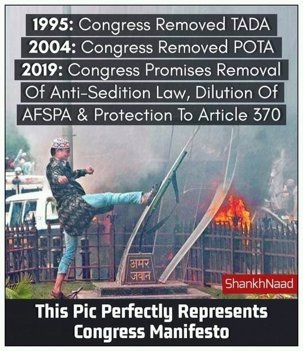

# Overview

The VFRAME/Check image deduplication API will provide capabilities to determine if a query image matches any prior submitted query images. The service is designed to integrate with the Check workflow described below.

## Requirements

- provide matching results for at least 
	- Second rate: peak 1 image every 10 seconds
	- Hourly rate: ≈3.6K images per hour
	- Daily rate: ≈87K image requests submitted per day
	- Weekly rate: ≈610K images per week
- provide an authenticated API service to match a query image to all previously submitted query images and receive a match result
- authenticated requests only to protect against misuse
- authenticated services for Check will be handled manually requesting/exchanging credentials
- provide an interactive demo page to help Check users understand threshold settings
- provide adjustable threshold settings in URI parameter, and/or provide list of similar matches with threshold
- scale to accommodate up to 1 million unique image records to compare against
- after 1M records, we will need to rescale/rebuild the architecture to accommodate 

## User story

- Audience member sends image to a number on WhatsApp (or generically, user adds an image to Check). - Handled by Smooch.
	- Image is ingested into Check. 
	- Handled by Smooch & Check.
	- Image is matched against existing images in Check.
	- MVP:
		- detect near-identical matches that are different sizes, resolutions.
		- Assess for feasibility:
			- find same meme images used for different claims
			- find same claims using different meme images
			- find same images (not memes) with different text
			- find same images + text in different physical files
	- Image is automatically related to any matching images in Check.
	- Analyst can confirm matches and dissociate any false matches. - Handled in Check
	- Audience member receives the verification result for any matching images with existing final-status. 
	- Handled in Check, Smooch, and WA Business API
    

## Example Images

Matches that can be detected

|Query|Known Image|Match|Notes|
|---|---|---|---|
|||True|Different size|

Matches that can be detected

|Query|Known Image|Match|Notes|
|---|---|---|---|
|||True|Small grey border|
|||True|Small black
 border|
|||True|Slightly desaturated|

Matches that can be detected

|Query|Known Image|Match|Notes|
|---|---|---|---|
|||True|Different JPG export quality|
|||True|Image slightly stretched horizontally|
|||True|Image slightly stretched vertically|

Similar images that can not be detected

|Query|Known Image|Match|Notes|
|---|---|---|---|
|||False|collage|
|||False|collage, and text section|

## Data Retention

- we will retain the posted images and store:
	- the computed hash features
	- timestamp
	- sha256 of the file
- mysql data will be stored on a server in Frankfurt
- image data on S3 storage will be stored on a server in Amsterdam

## Out of Scope

- Interactive matching
- Video matching
- Content analysis
- Text detection, text recognition (OCR)
- User-in-the-loop machine learning for improvement of matching algorithms

## Assets Required

- we will need a sample set of images to test and calibrate with here
- and timely feedback to make any needed revisions

